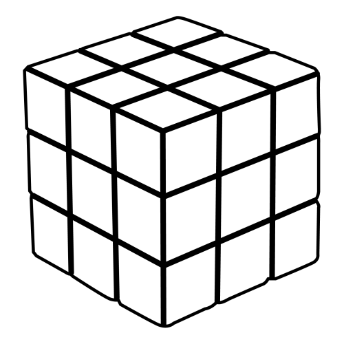
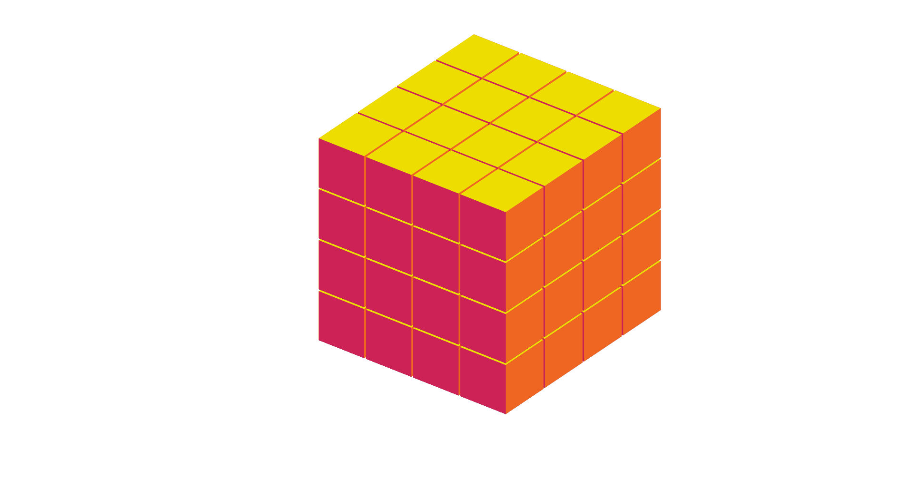

# objetivo
- Recrear y animar la siguiente imagen en Zdog.js
)

# Resultado final


[Pagina web](https://carloscruzvalencia.github.io/Cube-Zdog.js/)
<details open>
<summary>Documentacion del proyecto</summary>

## Generamos un grupo donde almacenar todos los cubos
```JavaScript 
let rubikCubes = new Zdog.Anchor({
    addTo: rubik

});
```

## Mediante un bucle se generan los cubos nesesarios
```JavaScript 
ps = 10
for (i = 0; i != 4; i++) {
    let box = new Zdog.Box({
        addTo: rubikCubes,
        width: 120,
        height: 120,
        depth: 130,
        stroke: false,
        color: '#C25',
        leftFace: '#EA0',
        rightFace: '#E62',
        topFace: '#ED0',
        bottomFace: '#636',
        translate: {
            x: i * 125,
            y: 10
        }
    });
    for (j = 0; j != 3; j++) {
        box.copy({
            addTo: rubikCubes,
            translate: {
                y: ps += 125,
                x: i * 125,
                z: 0
            },
        });
    }
    ps = 10
}
```
## Con la funcion ```.copyGraph``` generamos los bloques que faltan
```JavaScript
for (i =0 ;i != 4;i++){
    rubikCubes.copyGraph({
        translate: {
            x: 0,
            z: i * -135
        },
    })
}
```
# Resultado final


visita la pagina web
[Pagina web](https://carloscruzvalencia.github.io/Cube-Zdog.js/)
</details>
